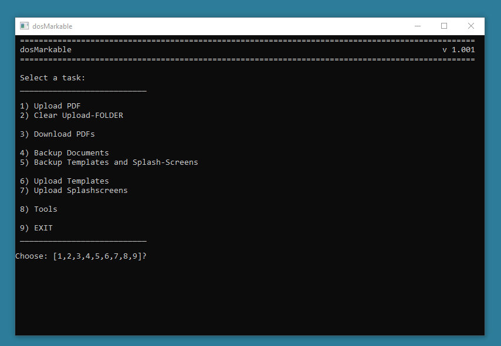

**USE AT OWN RISK. There are some commands that uses delete *.*! So be carefull!**
**It also overwrites some files on the reMarkable. So be carefull again!**
**I am not computer expert. I have amateurishly cobbled together this script.****

# dosMarkable
CMD.exe Batch script for the reMarkable tablet for Windows (tested on Windows 11)

This script uses only system commands to deal with the reMarkable tablet (https://remarkable.com).

It depends on:
- the USB-Webinterface (see [reMarkable Wiki](https://remarkablewiki.com/tech/webinterface)
- SSH over USB (see [remarKable wiki](https://remarkablewiki.com/tech/ssh))

It includes the following functions:
- Upload and rename PDFs from a folder
- Backup the document folder from the reMarkable tablet via SSH
- Backup all files as PDF
- Clear tombstone files after empty trash
- Backup templates and splashscreens from the reMarkable tablet via SSH
- SSH into the reMarkable tablet via SSH

My skills in creating .bat files are limited, so improvements are highly welcome.

---
## Installation:

1) Create a folder on your harddrive, for an example: C:\Users\USERNAME\PROGRAMMFOLDER\dosMarkable\
2) Create the following folders:
  - Backup
  - Splashscreens
  - Templates
  - Upload
  - PDF
  - PDF / ALL
3) Set 
2) Copy dosMarkable.bat where ever you want. Maybe in dosMarkable folder.
3) Create a Alias for the dosMarkable.bat (if you like)
4) Edit the dosMarkable.bat and setup the folders.

---
## Screenshot

